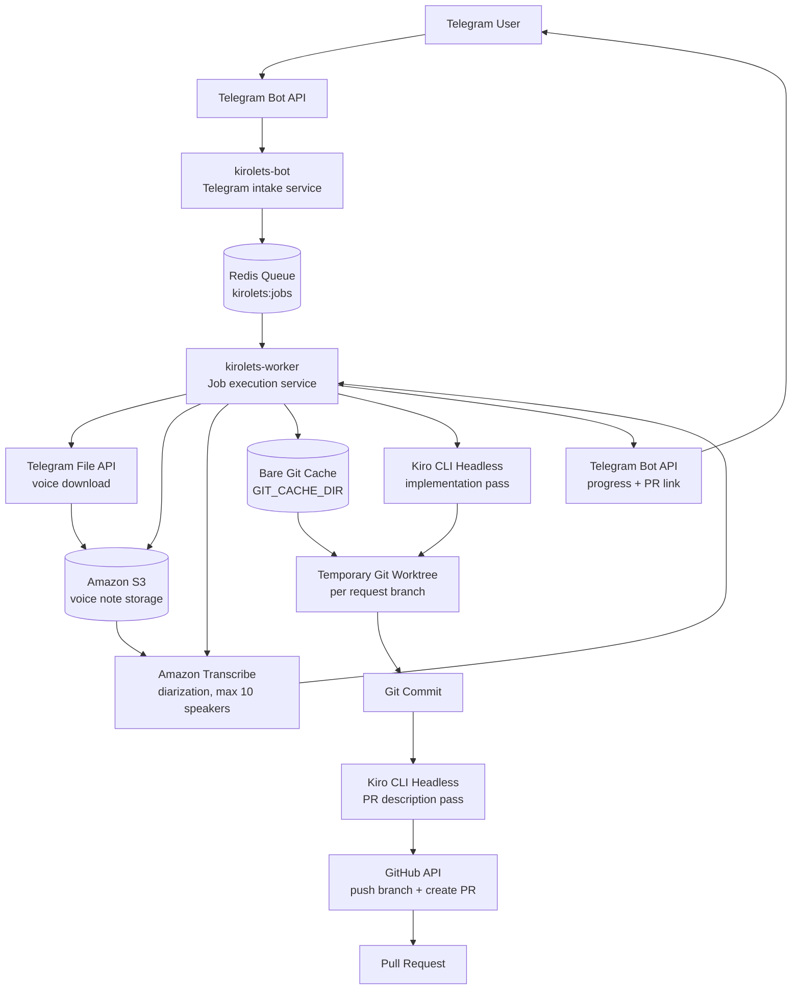

# Kirolets Telegram Bot


Kirolets lets Kiro users ask for code changes from Telegram.

The long-term idea is simple: give Kiro users a lightweight interface they can use from
wherever they already are. Telegram is the first surface. Later, the same request workflow
can be exposed from other chat apps, webhooks, internal tools, or automation entrypoints.

Kiro itself provides an agentic development experience across IDE, CLI, and web. Kirolets
focuses on the CLI path: it turns a Telegram text message or voice note into a headless
Kiro CLI run against a configured GitHub repository, then returns a pull request for review.

## How It Uses Kiro

Kiro's headless CLI mode is designed for automation contexts such as CI/CD pipelines,
code review, test generation, and build troubleshooting. In that mode, Kiro runs without
an interactive terminal by receiving a prompt up front:

```bash
kiro-cli chat --no-interactive "your prompt here"
```

Because there is no human sitting inside the terminal to approve tool calls, Kirolets uses
scoped tool trust through `--trust-tools`:

```bash
kiro-cli chat --no-interactive --trust-tools=read,grep,write,bash "implement the request"
```

The Kiro API key is supplied through `KIRO_API_KEY`, matching the headless CLI
authentication model. Keep that value in deployment secrets and never commit it.

## Requirements

- uv
- Python 3.14
- Redis
- A Telegram bot token from BotFather

## Setup

```powershell
uv python install 3.14
uv sync --dev
Copy-Item .env.example .env
```

Edit `.env` and set `TELEGRAM_BOT_TOKEN`.
Also configure the AWS, GitHub, and Kiro variables shown in `.env.example`.

## Architecture



At runtime, Kirolets is one codebase with two process roles:

- `kirolets-bot` receives Telegram updates and enqueues jobs.
- `kirolets-worker` consumes Redis jobs, runs transcription/Kiro/GitHub work, and sends progress replies.

## Bot Flow

For each text message or voice note, the bot:

1. Transcribes voice notes through S3 and Amazon Transcribe with speaker diarization enabled for up to 10 speakers.
2. Uses text messages directly when no transcription is needed.
3. Updates a local bare Git cache for the configured GitHub repository.
4. Creates a temporary worktree and branch for the Telegram request.
5. Runs Kiro CLI in headless mode with the message or transcript as the prompt.
6. Commits any generated changes.
7. Invokes Kiro again with the original request, commit log, and diff stat to draft the PR title and description.
8. Pushes the branch, opens a GitHub PR, and sends the PR link back to Telegram.

Long-running transcription and Kiro stages send progress updates back to the chat.

## Required Configuration

All runtime configuration is provided through environment variables:

```env
TELEGRAM_BOT_TOKEN=
TELEGRAM_ALLOWED_USER_IDS=

AWS_REGION=
AWS_TRANSCRIBE_BUCKET=
AWS_TRANSCRIBE_UPLOAD_PREFIX=telegram-voice-notes
AWS_TRANSCRIBE_LANGUAGE_CODE=en-US

GITHUB_REPOSITORY_URL=
GITHUB_TOKEN=
GITHUB_USERNAME=
GITHUB_EMAIL=
GITHUB_BASE_BRANCH=main
GIT_CACHE_DIR=.kirolets/git-cache

KIRO_API_KEY=
KIRO_TRUST_TOOLS=read,grep,write,bash

PROGRESS_UPDATE_INTERVAL_SECONDS=30
REDIS_URL=redis://localhost:6379/0
REDIS_QUEUE_NAME=kirolets:jobs
QUEUE_WORKER_CONCURRENCY=1
YOLO=false
TRANSCRIBE_POLL_INTERVAL_SECONDS=5
TRANSCRIBE_TIMEOUT_SECONDS=900
KIRO_TIMEOUT_SECONDS=1800
```

Use narrowly scoped `KIRO_TRUST_TOOLS` values where possible. Kiro's docs recommend
specific tool categories over trusting every tool, which matches the bot's default.

Set `TELEGRAM_ALLOWED_USER_IDS` to a comma-separated list of numeric Telegram user IDs to
restrict who can use the bot. Leave it empty to allow any Telegram user who can message the
bot.

`GITHUB_USERNAME` and `GITHUB_EMAIL` are used as the Git commit identity inside temporary
worktrees. Set them to a real GitHub username and email, or a GitHub no-reply email, so
`git commit` works inside containers.

## Queueing

Telegram updates are enqueued in Redis so the bot can acknowledge messages quickly while
Kirolets processes long-running transcription and Kiro jobs in the background. The default
worker concurrency is `1`, which means requests are handled one at a time in FIFO order.
Increase `QUEUE_WORKER_CONCURRENCY` later when the workflow is ready for parallel Kiro runs.

Kirolets is split into two process roles:

- `kirolets-bot` receives Telegram updates and enqueues jobs.
- `kirolets-worker` consumes Redis jobs, runs transcription/Kiro/GitHub work, and sends progress replies.

## Git Workspace Strategy

Kirolets keeps a bare Git repository cache under `GIT_CACHE_DIR` instead of cloning the
whole repository from GitHub for every request. Each Telegram request fetches the latest
refs into that cache, creates a temporary linked worktree, lets Kiro edit files there,
then removes the worktree after pushing the PR branch.

This keeps each request isolated while avoiding repeated full repository downloads.

## YOLO Mode

By default, Kirolets pushes Kiro's changes to a request branch and opens a GitHub PR.
Set `YOLO=true` to skip PR creation and push the completed commit directly to
`GITHUB_BASE_BRANCH`.

Use this only for repositories where direct bot commits are acceptable. The GitHub token
must have permission to push to the base branch, and branch protection rules may still
reject the push.

## Run

```powershell
uv run kirolets-bot
```

Run a worker in a second process:

```powershell
uv run kirolets-worker
```

During development you can also run the bot module directly:

```powershell
uv run python -m kirolets_bot
```

## Test

```powershell
uv run pytest
```

## Deployment Requirements

`requirements.txt` is exported from `uv.lock` for platforms that expect pip-style
dependency files:

```powershell
uv export --format requirements-txt --no-dev --no-hashes --output-file requirements.txt
```

## Docker

```powershell
docker build -t kirolets-bot .
docker run --env-file .env --env REDIS_URL=redis://host.docker.internal:6379/0 kirolets-bot
```

The Docker image includes `git` and installs `kiro-cli` using Kiro's documented installer:

```bash
curl -fsSL https://cli.kiro.dev/install | bash
```

The app image does not run Redis itself. The Python Redis client is installed through
`uv sync --locked --no-dev`, and Redis should run as a separate service. For local
container usage:

```powershell
docker compose up --build
```

## Deployment Guides

- [EasyPanel installation guide](docs/easypanel-installation.md)

## Project Layout

```text
src/kirolets_bot/     Bot application code
tests/                Automated tests
.env.example          Example local environment file
```
